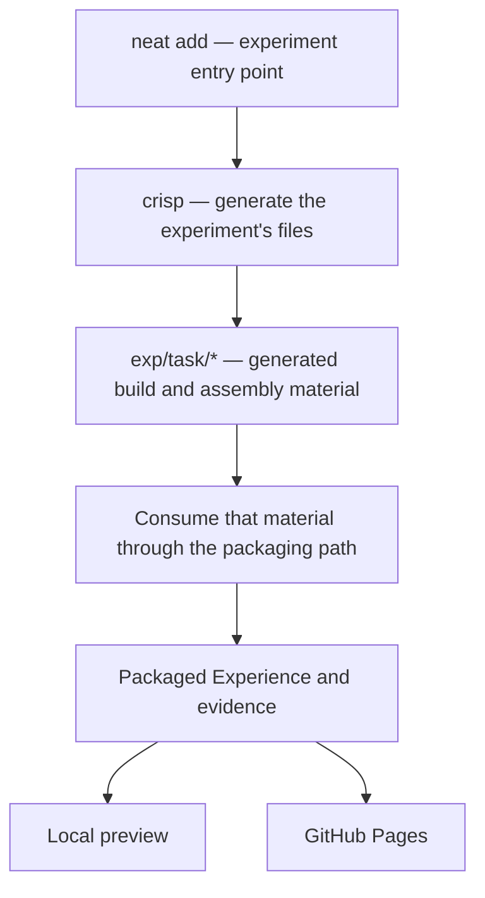

# Generation comes before packaging

Update: the local Node manifest-to-crisp seam is now implemented and tested.
See [crisp-scaffolds.md](crisp-scaffolds.md): tidy supplies the live definition,
`crisp scaffold` generates the Experience, and `crisp package` consumes that
definition on every build. The historical inspection below explains the starting
point; locating the original `neat add` wrapper is not a prerequisite for using
this new path. BuildBag is its first generated scaffold.

Sam's correction, 2026-09-14: `neat add` internally uses crisp to generate
`exp/<task>/*`; crisp already knows build and assembly. The architectural map must
start with that generation step. The current local PxCube runner starts farther
downstream and must not be described as the origin of those responsibilities.

The top path above records Sam's description. Its exact `neat add` implementation
has not yet been located in the snapshots inspected below; it is not presented as
a newly verified call graph. In particular, the generated file schema and its
connection to `experience.json` still need tracing before changing this adapter.

## What was actually inspected

- PxCube's vendored neat is commit `be9a1ec7`. Its `src/cli.ts` offers check,
  next, board, html, matrix and update; it contains no add command. Remote neat
  main still points to that commit at this inspection. The published
  impl/DiscStudio and task/review-handoff branches were fetched without switching
  the working branch; the searched sources did not expose the add/crisp path.
- The local Claude-fresh Python source `pyto/src/pyto/crisp.py` does contain
  template, vary and import. These produce composition proposals and run/import
  their PQL through existing machinery. `pyto/scripts/neat.sh` forwards
  `neat crisp` to that module. This is an existing generation capability, not
  something introduced by the PxCube coordinator.
- PxCube's `crisp/lib/packager.mjs` implements the currently used package path:
  check the manifest/source, execute the manifest's build command, record outputs.
- `local/run.mjs` currently discovers `experiences/*/experience.json`, snapshots
  source, calls packageApp, checks the ledgers, and assembles a preview artifact.
  It also creates initial work items and registrations. Those responsibilities
  need comparison with the upstream generation path before expanding this code.

## Integration implication

Trace the generated experiment's build/assembly material into the consumer.
Keep local serving and GitHub publication as destinations for that material.
Do not invent another authoring contract merely because this local adapter
already accepts hand-assembled Experience folders. Do not assume Python crisp's
proposal schema and PxCube crisp's manifest schema are interchangeable without
checking their actual connection. No executable behavior changes in this note.
